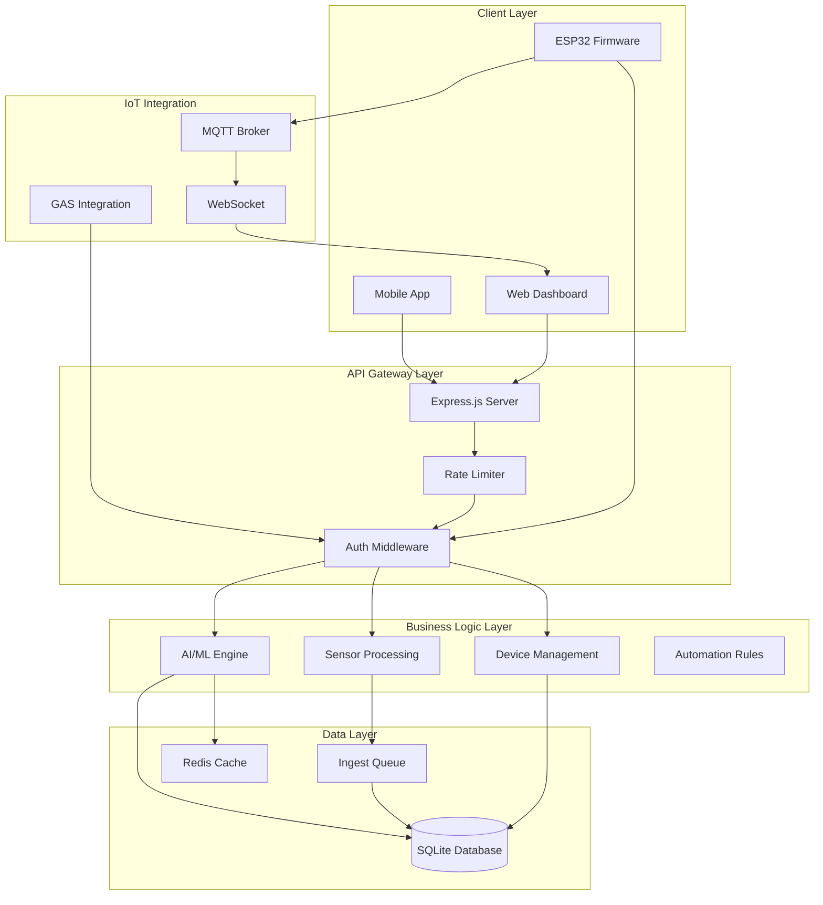
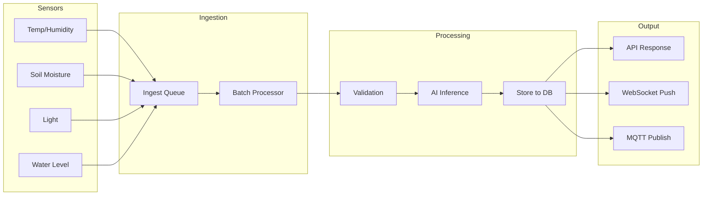
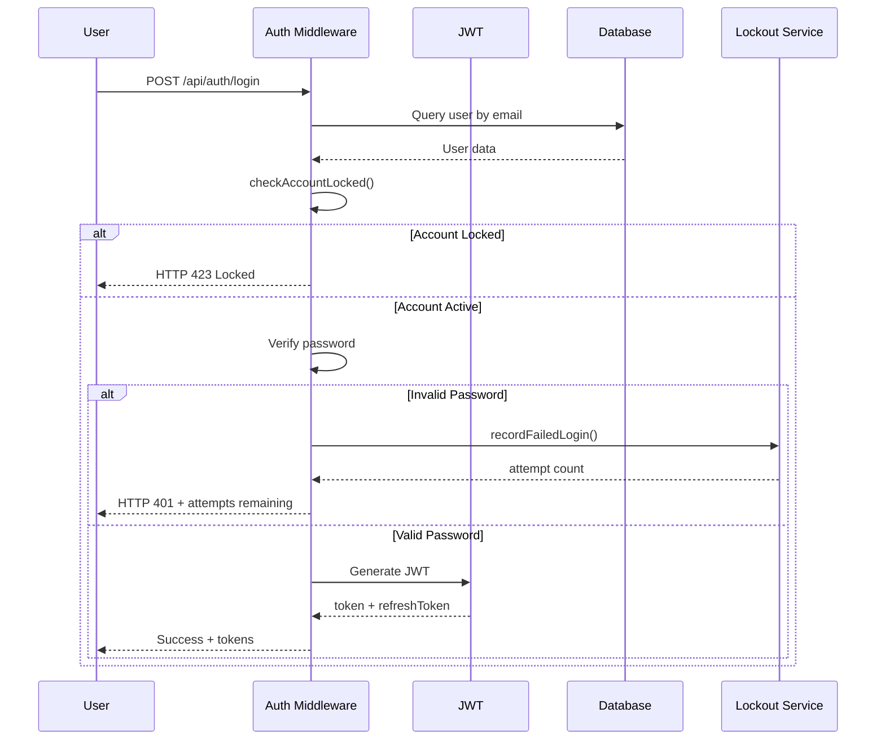
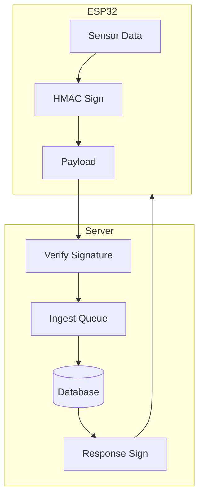
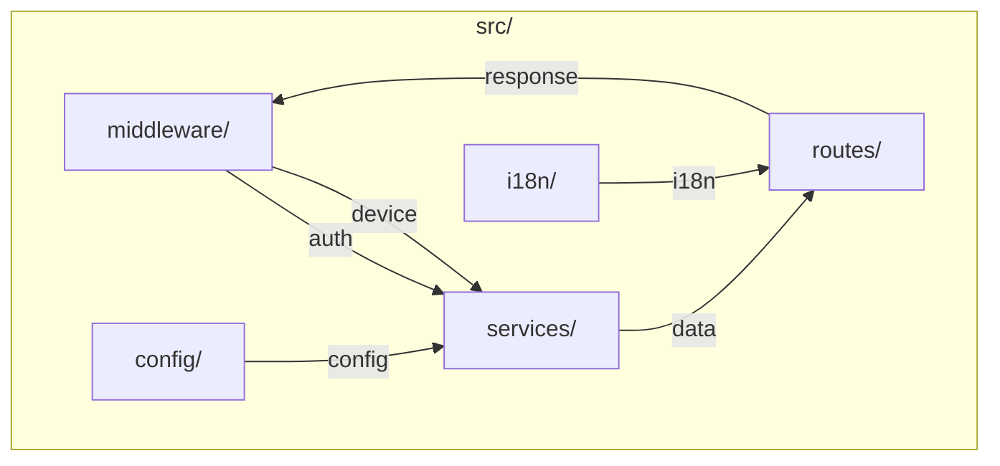
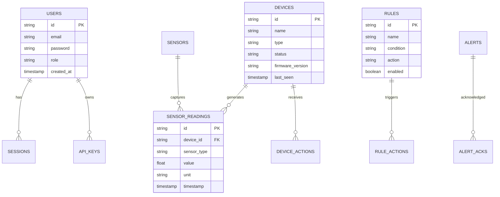
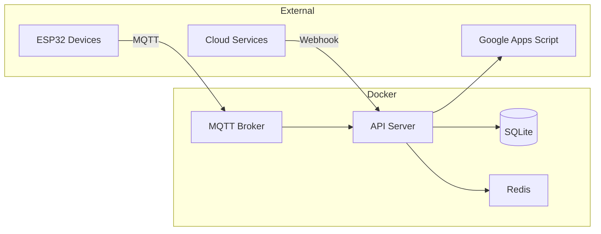

# EcoSynTech Local Core - Architecture Documentation

## 1. System Architecture Overview

## 2. Data Flow Diagram

## 3. Authentication Flow

## 4. IoT Device Communication

## 5. Module Structure

## 6. Database Schema

## 7. Deployment Architecture

---

## Revision History

| Version | Date | Changes | Author |
|---------|------|---------|--------|
| 1.0 | 2026-04-28 | Initial architecture diagrams | EcoSynTech Team |

---

*Document generated following ISO 27001 documentation standards*