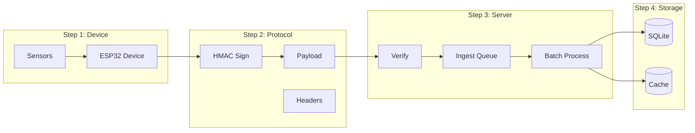
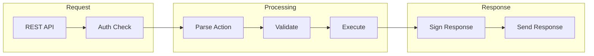
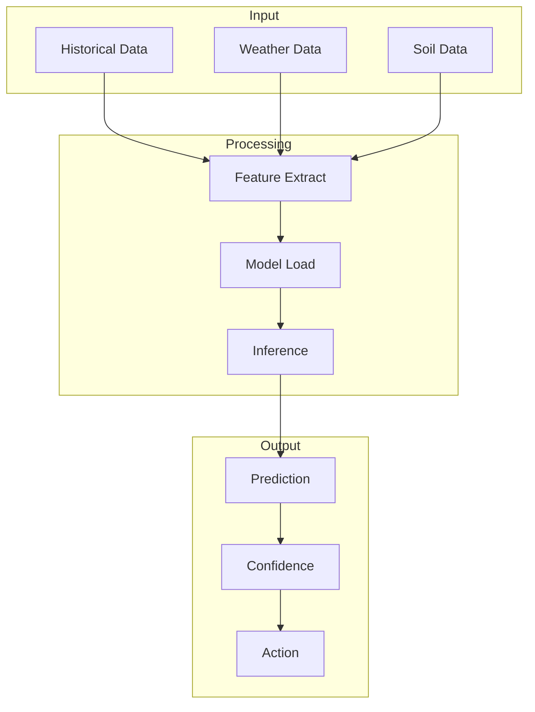
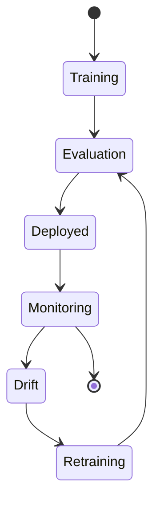
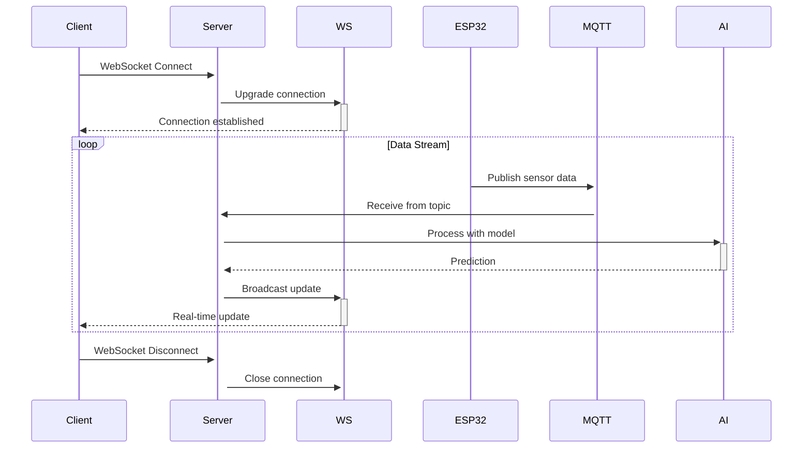
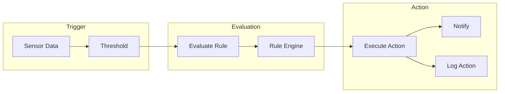
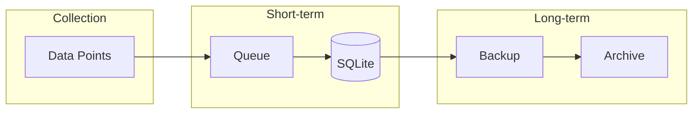

# EcoSynTech Local Core - Data Flow Documentation

## 1. Sensor Data Flow

### 1.1 Raw Data Ingestion



### 1.2 Data Processing Pipeline

| Step | Component | Description |
|------|-----------|-------------|
| 1 | Sensor | Collects temperature, humidity, soil moisture, light |
| 2 | ESP32 | Packages data with timestamp and signs with HMAC |
| 3 | deviceAuth | Verifies HMAC signature |
| 4 | IngestQueue | Buffers data (max 10,000 readings) |
| 5 | BatchProcessor | Processes 100 readings per batch |
| 6 | Database | Stores in sensor_readings table |
| 7 | Cache | Updates Redis cache |

## 2. API Request Flow

### 2.1 Authentication Flow

```mermaid
sequenceDiagram
    Client->>+Server: POST /api/auth/login
    Server->>+Database: SELECT user WHERE email=?
    Database-->>-Server: user record
    Server->>+bcrypt: verify password
    bcrypt-->>-Server: true/false
    alt invalid password
        Server->>+Lockout: recordFailedLogin()
        Lockout-->>-Server: attempts count
        Server-->>-Client: 401 + attempts remaining
    else valid password
        Server->>+JWT: sign token
        JWT-->>-Server: access + refresh token
        Server->>+Redis: store refresh token
        Server-->>-Client: 200 + tokens
    end
```

### 2.2 Device Action Flow



## 3. AI/ML Inference Flow

### 3.1 Prediction Pipeline



### 3.2 Model Management Flow



## 4. WebSocket Real-time Flow



## 5. Automation Rules Flow



## 6. Data Retention Flow



### Retention Policy

| Data Type | Short-term | Long-term | Archive |
|-----------|------------|------------|---------|
| Sensor Readings | 7 days | 90 days | 1 year |
| System Logs | 30 days | 1 year | 3 years |
| User Actions | 90 days | 2 years | 5 years |
| AI Predictions | 30 days | 1 year | 3 years |

---

## Revision History

| Version | Date | Changes | Author |
|---------|------|---------|--------|
| 1.0 | 2026-04-28 | Initial data flow documentation | EcoSynTech Team |

---

*Document follows ISO 27001 information classification guidelines*